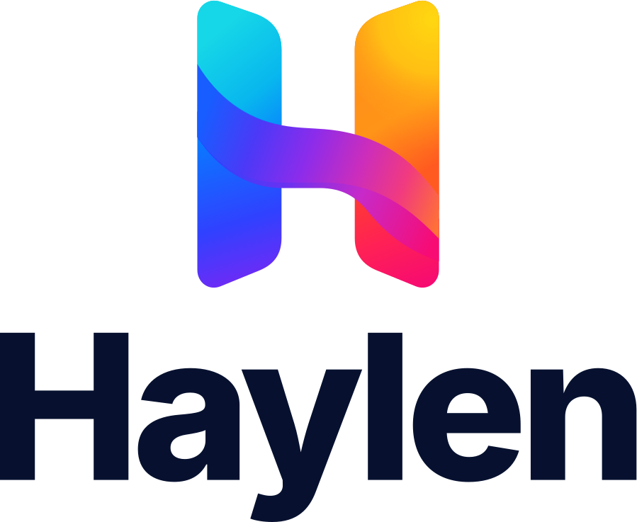

<p align="center">
    <a href="https://github.com/haylen-org/haylen" target="_blank" rel="noopener noreferrer">
        <picture>
            <source media="(prefers-color-scheme: dark)" srcset="extras/images/logo-v-dark.svg">
            
        </picture>
    </a>
</p>

<p align="center">
    <a href="https://github.com/haylen-org/haylen/actions/workflows/ci.yml"></a>
    <a href="https://github.com/haylen-org/haylen/blob/main/LICENSE"></a>
    <a href="https://isocpp.org"></a>
    <a href="https://github.com/varn-org/varn"></a>
    
</p>

<p align="center">
The engine for games, multimedia apps and applications, with a fast C++20 core, a complete Lua API and one app package for every platform.
</p>

<br>

## Project

Haylen is a reusable engine for games, multimedia apps and applications, 2D today, with a fast C++20 core and a complete Lua API. Apps are written in Lua, and every capability stays fully usable from C++. One app package, a folder or a zip file with `app.json`, its Lua modules under `source/` and its assets under `content/`, runs on macOS, Windows, Linux, iOS, iPadOS, Mac Catalyst, tvOS, Android phones, tablets and TVs, and the web with WebGPU or WebGL2.

The repository holds the engine, the `haylen` desktop player, the platform templates, the native plugin tooling and the samples, among them Tiny Island, a complete survival game built with the Tiny Swords art pack.

## Highlights

- Batched sprite rendering through Sokol, with millions of animated sprites per frame, SDF text, nine-slices, 2D lights, post-processing and render targets.
- Tiled maps with every orientation, animated tiles, parallax, blend modes, collision and object spawning.
- Box2D physics, particles, 2D lighting, A\* navigation with steering, tweens, state machines and a spatial hash.
- Keyboard, mouse, touch, gestures and gamepads behind one action map, with on-screen touch controls.
- Text in every script, shaped with HarfBuzz and ordered right to left where a language reads that way, in 2D drawing, rich text and a UI that mirrors for Arabic and Hebrew.
- A themed UI with menus, HUD components, dialogs and nine-slice skins, plus Dear ImGui for tools.
- Audio buses, streamed music with crossfades and positional sounds.
- Asset preload groups, saves, settings, localization, WebSockets and a JSON bridge to native platform code.
- Async Lua through the [Varn](https://github.com/varn-org/varn) runtime: promises, coroutines, HTTP, sockets and worker pools that never block the frame.
- A web runtime ready for a browser editor: packages loaded at runtime, restart, hot reload, logs and Lua stack traces forwarded to JavaScript.

## Quick start

Haylen needs CMake 3.28 or newer, Ninja, Python 3.10 or newer and a C++20 compiler. The script `make.py` downloads the pinned shader compiler, and the Emscripten SDK and Gradle the first time a web or Android build needs them. Apple platforms need Xcode and Android needs the Android SDK with NDK 30.

```sh
python3 make.py assets ~/Downloads/"Tiny Swords (Free Pack).zip"
python3 make.py run games/tiny-island
```

The first command imports the [Tiny Swords](https://pixelfrog-assets.itch.io/tiny-swords) pack into the Tiny Island sample, and the second builds the desktop player and runs the game with hot reload. The command `python3 make.py test` builds and runs the engine tests.

A new app starts with `make.py new`, which writes a small starter app and a project of every platform, which belongs to the developer:

```sh
python3 make.py new ~/apps/my-app --name "My App" --identifier com.example.myapp
python3 make.py run ~/apps/my-app
python3 make.py run ~/apps/my-app --platform ios-simulator
python3 make.py run ~/apps/my-app --platform android
python3 make.py run ~/apps/my-app --platform web
```

With `--platform`, `run` builds the prebuilt engine for that platform once, writes the app into the generated folder of the platform project, builds the project and launches it on macOS, iOS and tvOS simulators and devices, Mac Catalyst, Android devices and emulators, or a local web server. The app itself never compiles the engine.

An app is a folder like this one:

```text
my-app/
  app.json          Name, identifier, version, window, design resolution and splash screen.
  source/
    main.lua        Entry point.
    scenes/         Any other Lua modules, loaded with require('scenes.title').
  content/          Textures, sounds, fonts, maps and data.
  plugins/          Plugins with native code, such as sign-in or ads.
  platform/         The Xcode, Android and web projects, which make.py builds where they are.
```

```lua
local graphics2d = require('haylen.graphics2d')
local scene = require('haylen.scene')

scene.push({
    render = function(self)
        graphics2d.beginScreen()
        graphics2d.drawText(nil, 'Hello, island', 960, 540, {size = 96, anchor = {0.5, 0.5}})
    end,
})
```

The command `python3 make.py package my-app` zips the package, and the [distribution guide](docs/distribution.md) covers every platform. C++ apps add the engine to their CMake project and call `haylen_add_app`, as the [embedding guide](docs/embedding.md) shows.

## Documentation

- [Lua API reference](docs/lua-api.md)
- [Lua guide](docs/lua.md), [lifecycle](docs/lifecycle.md) and [architecture](docs/architecture.md)
- [Distributing apps](docs/distribution.md), [plugins](docs/plugins.md), [building the engine](docs/build.md) and [using the engine as a library](docs/embedding.md)
- [Rendering](docs/rendering.md), [shaders](docs/shaders.md), [text](docs/text.md), [UI](docs/ui.md), [text input](docs/text-input.md), [Tiled](docs/tiled.md), [audio](docs/audio.md), [input](docs/input.md) and [desktop apps](docs/desktop.md)
- [Platform bridge](docs/platform_bridge.md) and [testing](docs/testing.md)
- [Tiny Island](samples/games/tiny-island/README.md)

## License

Haylen is released under the license in [LICENSE](LICENSE). The Tiny Swords art belongs to Pixel Frog and is not part of this repository. The sounds and fonts of Tiny Island are CC0, with credits next to them.
